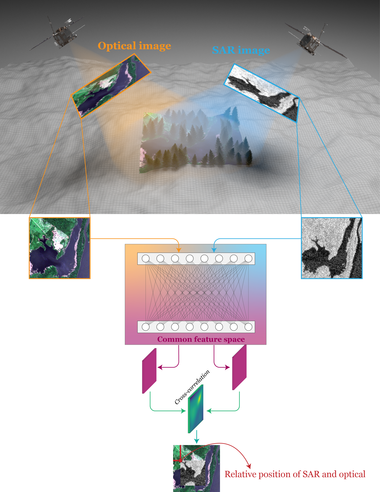
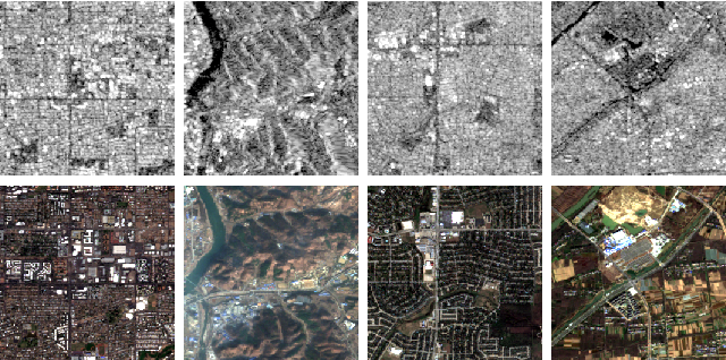

# SAR-Optical Matching  📡 🛰️

Synthetic aperture radar (SAR) and optical are the most common sensors for
earth observation, each providing a unique livel of details.  
Therefore, combining the two sensors has the potential to increase the information content and open new use cases in remote sensing applications, given the complementary information from SAR and optical imagery.

Image matching is the process of aligning two or more images. 
The SAR-optical matching is especially problematic due to the significant radiometric and geometric differences and the visual disparities introduced by different remote sensing sensors.

### Goal: 

We propose and develop an end-to-end machine learning pipeline for automatic sar-optical matching.  

The relative paper can be found at: https://ieeexplore.ieee.org/abstract/document/10129005

### Dataset:

We used the [SEN1-2](https://arxiv.org/abs/1807.01569) open dataset consisting of
282,384 co-registered SAR-optical image patches, including all four seasons and environments (e.g., urban, rural, deserts, mountains, etc.). 

### Tutorial notebook:

The [main_example.ipynb](main_example.ipynb) Jupyter notebook provides a clean example of how to create, load and use the model for SAR-optical matching. 

 
